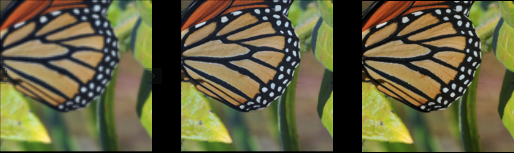

# SRGAN-PyTorch

## Overview

This repository contains an op-for-op PyTorch reimplementation of [Photo-Realistic Single Image Super-Resolution Using a Generative Adversarial Network](https://arxiv.org/abs/1609.04802v5)
.

### Table of contents

- [SRGAN-PyTorch](#srgan-pytorch)
  - [Overview](#overview)
    - [Table of contents](#table-of-contents)
    - [Download weights](#download-weights)
    - [Download dataset](#download-dataset)
      - [Download train dataset](#download-train-dataset)
      - [Download val dataset](#download-val-dataset)
    - [Test (e.g Set5)](#test-eg-set5)
    - [Train (e.g DIV2K)](#train-eg-div2k)
    - [Result](#result)
    - [Contributing](#contributing)
    - [Credit](#credit)
      - [Photo-Realistic Single Image Super-Resolution Using a Generative Adversarial Network](#photo-realistic-single-image-super-resolution-using-a-generative-adversarial-network)

### Download weights

- [Google Driver](https://drive.google.com/file/d/1lBT7msKjLkkAxYee80_mEby_e6pTeLMV/view?usp=sharing)
- [Baidu Driver](https://pan.baidu.com/s/1UpmKF5ABCP2L2DKT9cUlqg) access:`llot`

### Download dataset

#### Download train dataset

```bash
cd data/
bash download_dataset.sh
```

#### Download val dataset

Set5 dataset:

- [Google Driver](https://drive.google.com/file/d/1GtQuoEN78q3AIP8vkh-17X90thYp_FfU/view?usp=sharing)
- [Baidu Driver](https://pan.baidu.com/s/1dlPcpwRPUBOnxlfW5--S5g) access:`llot`

Set14 dataset:

- [Google Driver](https://drive.google.com/file/d/1CzwwAtLSW9sog3acXj8s7Hg3S7kr2HiZ/view?usp=sharing)
- [Baidu Driver](https://pan.baidu.com/s/1KBS38UAjM7bJ_e6a54eHaA) access:`llot`

BSD200 dataset:

- [Google Driver](https://drive.google.com/file/d/1cdMYTPr77RdOgyAvJPMQqaJHWrD5ma5n/view?usp=sharing)
- [Baidu Driver](https://pan.baidu.com/s/1xahPw4dNNc3XspMMOuw1Bw) access:`llot`

### Test (e.g Set5)

Modify the contents of the file as follows.

1. `config.py` line 38 `mode="train"` change to `model="valid"`;
2. `config.py` line 102 `model_path=f"results/{exp_name}/g-best.pth"` change to `model_path=f"<YOUR-WEIGHTS-PATH>.pth"`;
3. Run `python validate.py`.

### Train (e.g DIV2K)

Modify the contents of the file as follows.

1. `config.py` line 38 `mode="valid"` change to `model="train"`;
2. Run `python train.py`.

If you want to load weights that you've trained before, modify the contents of the file as follows.

1. `config.py` line 38 `mode="valid"` change to `model="train"`;
2. `config.py` line 56 `start_p_epoch=0` change to `start_p_epoch=XXX`;
3. `config.py` line 58 `resume=False` change to `resume=True`;
4. `config.py` line 59 `resume_p_weight=""` change to `resume_p_weight=<YOUR-RESUME-WIGHTS-PATH>`;
5. Run `python train.py`.

### Result

Source of original paper results: [https://arxiv.org/pdf/1609.04802v5.pdf](https://arxiv.org/pdf/1609.04802v5.pdf)

In the following table, the value in `()` indicates the result of the project, and `-` indicates no test.

| Dataset | Scale |       PSNR       |        SSIM        |     MOS     |
| :-----: | :---: | :--------------: | :----------------: | :---------: |
|  Set5   |   4   | 29.40(**29.74**) | 0.8472(**0.8509**) | 3.58(**-**) |
|  Set14  |   4   | 26.02(**26.76**) | 0.7397(**0.7354**) | 3.72(**-**) |
| BSDS100 |   4   | 25.16(**26.92**) | 0.6688(**0.7148**) | 3.56(**-**) |

Low resolution / Recovered High Resolution / Ground Truth
<span align="center"></span>

### Contributing

If you find a bug, create a GitHub issue, or even better, submit a pull request. Similarly, if you have questions,
simply post them as GitHub issues.

I look forward to seeing what the community does with these models!

### Credit

#### Photo-Realistic Single Image Super-Resolution Using a Generative Adversarial Network

_Christian Ledig, Lucas Theis, Ferenc Huszar, Jose Caballero, Andrew Cunningham, Alejandro Acosta, Andrew Aitken,
Alykhan Tejani, Johannes Totz, Zehan Wang, Wenzhe Shi_ <br>

**Abstract** <br>
Despite the breakthroughs in accuracy and speed of single image super-resolution using faster and deeper convolutional
neural networks, one central problem remains largely unsolved: how do we recover the finer texture details when we
super-resolve at large upscaling factors? The behavior of optimization-based super-resolution methods is principally
driven by the choice of the objective function. Recent work has largely focused on minimizing the mean squared
reconstruction error. The resulting estimates have high peak signal-to-noise ratios, but they are often lacking
high-frequency details and are perceptually unsatisfying in the sense that they fail to match the fidelity expected at
the higher resolution. In this paper, we present SRGAN, a generative adversarial network (GAN) for image
super-resolution (SR). To our knowledge, it is the first framework capable of inferring photo-realistic natural images
for 4x upscaling factors. To achieve this, we propose a perceptual loss function which consists of an adversarial loss
and a content loss. The adversarial loss pushes our solution to the natural image manifold using a discriminator network
that is trained to differentiate between the super-resolved images and original photo-realistic images. In addition, we
use a content loss motivated by perceptual similarity instead of similarity in pixel space. Our deep residual network is
able to recover photo-realistic textures from heavily downsampled images on public benchmarks. An extensive
mean-opinion-score (MOS) test shows hugely significant gains in perceptual quality using SRGAN. The MOS scores obtained
with SRGAN are closer to those of the original high-resolution images than to those obtained with any state-of-the-art
method.

[[Paper]](https://arxiv.org/pdf/1609.04802)

```bibtex
@InProceedings{srgan,
    author = {Christian Ledig, Lucas Theis, Ferenc Huszar, Jose Caballero, Andrew Cunningham, Alejandro Acosta, Andrew Aitken, Alykhan Tejani, Johannes Totz, Zehan Wang, Wenzhe Shi},
    title = {Photo-Realistic Single Image Super-Resolution Using a Generative Adversarial Network},
    booktitle = {arXiv},
    year = {2016}
}
```
