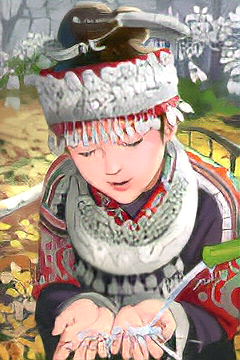

# SRGAN-PyTorch

## Overview

This repository contains an op-for-op PyTorch reimplementation of [Photo-Realistic Single Image Super-Resolution Using a Generative Adversarial Network](https://arxiv.org/abs/1609.04802v5).

## Table of contents

- [SRGAN-PyTorch](#srgan-pytorch)
    - [Overview](#overview)
    - [Table of contents](#table-of-contents)
    - [Download weights](#download-weights)
    - [Download datasets](#download-datasets)
    - [How Test and Train](#how-test-and-train)
        - [Test](#test)
        - [Train SRResNet model](#train-srresnet-model)
        - [Resume train SRResNet model](#resume-train-srresnet-model)
        - [Train SRGAN model](#train-srgan-model)
        - [Resume train SRGAN model](#resume-train-srgan-model)
    - [Result](#result)
    - [Contributing](#contributing)
    - [Credit](#credit)
        - [Photo-Realistic Single Image Super-Resolution Using a Generative Adversarial Network](#photo-realistic-single-image-super-resolution-using-a-generative-adversarial-network)

## Download weights

- [Google Driver](https://drive.google.com/drive/folders/17ju2HN7Y6pyPK2CC_AqnAfTOe9_3hCQ8?usp=sharing)
- [Baidu Driver](https://pan.baidu.com/s/1yNs4rqIb004-NKEdKBJtYg?pwd=llot)

## Download datasets

Contains DIV2K, DIV8K, Flickr2K, OST, T91, Set5, Set14, BSDS100 and BSDS200, etc.

- [Google Driver](https://drive.google.com/drive/folders/1A6lzGeQrFMxPqJehK9s37ce-tPDj20mD?usp=sharing)
- [Baidu Driver](https://pan.baidu.com/s/1o-8Ty_7q6DiS3ykLU09IVg?pwd=llot)

Please refer to `README.md` in the `data` directory for the method of making a dataset.

## How Test and Train

Both training and testing only need to modify the `srresnet_config.py` file and `srgan_config.py` file. 

### Test

Modify the `srgan_config.py` file.

- line 32: `g_arch_name` change to `srresnet_x4`.
- line 39: `upscale_factor` change to `4`.
- line 41: `mode` change to `test`.
- line 43: `exp_name` change to `SRGAN_x4-DIV2K`.
- line 96: `g_model_weights_path` change to `./results/pretrained_models/SRGAN_x4-ImageNet-8c4a7569.pth.tar`.

```bash
python3 test.py
```

### Train SRResNet model

Modify the `srresnet_config.py` file.

- line 32: `g_arch_name` change to `srresnet_x4`.
- line 39: `upscale_factor` change to `4`.
- line 41: `mode` change to `train`.
- line 43: `exp_name` change to `SRResNet_x4-DIV2K`.

```bash
python3 train_srresnet.py
```

### Resume train SRResNet model

Modify the `srresnet_config.py` file.

- line 32: `g_arch_name` change to `srresnet_x4`.
- line 39: `upscale_factor` change to `4`.
- line 41: `mode` change to `train`.
- line 43: `exp_name` change to `SRResNet_x4-DIV2K`.
- line 59: `resume_g_model_weights_path` change to `./samples/SRGAN_x4-DIV2K/g_epoch_xxx.pth.tar`.


```bash
python3 train_srresnet.py
```

### Train SRGAN model

- line 31: `d_arch_name` change to `discriminator`.
- line 32: `g_arch_name` change to `srresnet_x4`.
- line 39: `upscale_factor` change to `4`.
- line 41: `mode` change to `train`.
- line 43: `exp_name` change to `SRGAN_x4-DIV2K`.
- line 58: `pretrained_g_model_weights_path` change to `./results/SRResNet_x4-DIV2K/g_last.pth.tar`.

```bash
python3 train_srgan.py
```

### Resume train SRGAN model

- line 31: `d_arch_name` change to `discriminator`.
- line 32: `g_arch_name` change to `srresnet_x4`.
- line 39: `upscale_factor` change to `4`.
- line 41: `mode` change to `train`.
- line 43: `exp_name` change to `SRGAN_x4-DIV2K`.
- line 61: `resume_d_model_weights_path` change to `./samples/SRGAN_x4-DIV2K/d_epoch_xxx.pth.tar`.
- line 62: `resume_g_model_weights_path` change to `./samples/SRGAN_x4-DIV2K/g_epoch_xxx.pth.tar`.


```bash
python3 train_srgan.py
```

## Result

Source of original paper results: [https://arxiv.org/pdf/1609.04802v5.pdf](https://arxiv.org/pdf/1609.04802v5.pdf)

In the following table, the psnr value in `()` indicates the result of the project, and `-` indicates no test.

| Set5 | Scale |      SRResNet      |       SRGAN        |
|:----:|:-----:|:------------------:|:------------------:|
| PSNR |   4   |  32.05(**32.14**)  |  29.40(**30.64**)  |
| SSIM |   4   | 0.9019(**0.8954**) | 0.8472(**0.8642**) |

| Set14 | Scale |      SRResNet      |       SRGAN        |
|:-----:|:-----:|:------------------:|:------------------:|
| PSNR  |   4   |  28.49(**28.57**)  |  26.02(**27.12**)  |
| SSIM  |   4   | 0.8184(**0.7815**) | 0.7397(**0.7321**) |

| BSD100 | Scale |      SRResNet      |       SRGAN        |
|:------:|:-----:|:------------------:|:------------------:|
|  PSNR  |   4   |  27.58(**27.56**)  |  25.16(**26.22**)  |
|  SSIM  |   4   | 0.7620(**0.7367**) | 0.6688(**0.6867**) |

```bash
# Download `SRGAN_x4-ImageNet-8c4a7569.pth.tar` weights to `./results/pretrained_models`
# More detail see `README.md<Download weights>`
python3 ./inference.py
```

Input: 

<span align="center"></span>

Output: 

<span align="center"></span>

```text
Build `srresnet_x4` model successfully.
Load `srresnet_x4` model weights `./results/pretrained_models/SRGAN_x4-ImageNet-8c4a7569.pth.tar` successfully.
SR image save to `./figure/comic_sr.png`
```

## Contributing

If you find a bug, create a GitHub issue, or even better, submit a pull request. Similarly, if you have questions, simply post them as GitHub issues.

I look forward to seeing what the community does with these models!

## Credit

### Photo-Realistic Single Image Super-Resolution Using a Generative Adversarial Network

_Christian Ledig, Lucas Theis, Ferenc Huszar, Jose Caballero, Andrew Cunningham, Alejandro Acosta, Andrew Aitken, Alykhan Tejani, Johannes Totz, Zehan
Wang, Wenzhe Shi_ <br>

**Abstract** <br>
Despite the breakthroughs in accuracy and speed of single image super-resolution using faster and deeper convolutional neural networks, one central
problem remains largely unsolved: how do we recover the finer texture details when we super-resolve at large upscaling factors? The behavior of
optimization-based super-resolution methods is principally driven by the choice of the objective function. Recent work has largely focused on
minimizing the mean squared reconstruction error. The resulting estimates have high peak signal-to-noise ratios, but they are often lacking
high-frequency details and are perceptually unsatisfying in the sense that they fail to match the fidelity expected at the higher resolution. In this
paper, we present SRGAN, a generative adversarial network (GAN) for image super-resolution (SR). To our knowledge, it is the first framework capable
of inferring photo-realistic natural images for 4x upscaling factors. To achieve this, we propose a perceptual loss function which consists of an
adversarial loss and a content loss. The adversarial loss pushes our solution to the natural image manifold using a discriminator network that is
trained to differentiate between the super-resolved images and original photo-realistic images. In addition, we use a content loss motivated by
perceptual similarity instead of similarity in pixel space. Our deep residual network is able to recover photo-realistic textures from heavily
downsampled images on public benchmarks. An extensive mean-opinion-score (MOS) test shows hugely significant gains in perceptual quality using SRGAN.
The MOS scores obtained with SRGAN are closer to those of the original high-resolution images than to those obtained with any state-of-the-art method.

[[Paper]](https://arxiv.org/pdf/1609.04802v5.pdf)

```bibtex
@InProceedings{srgan,
    author = {Christian Ledig, Lucas Theis, Ferenc Huszar, Jose Caballero, Andrew Cunningham, Alejandro Acosta, Andrew Aitken, Alykhan Tejani, Johannes Totz, Zehan Wang, Wenzhe Shi},
    title = {Photo-Realistic Single Image Super-Resolution Using a Generative Adversarial Network},
    booktitle = {arXiv},
    year = {2016}
}
```
